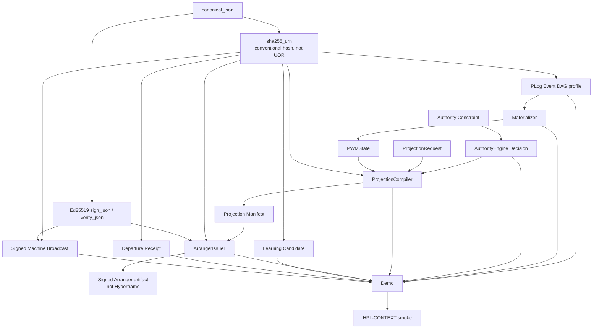
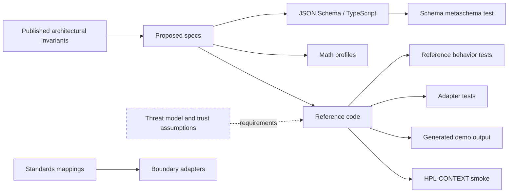
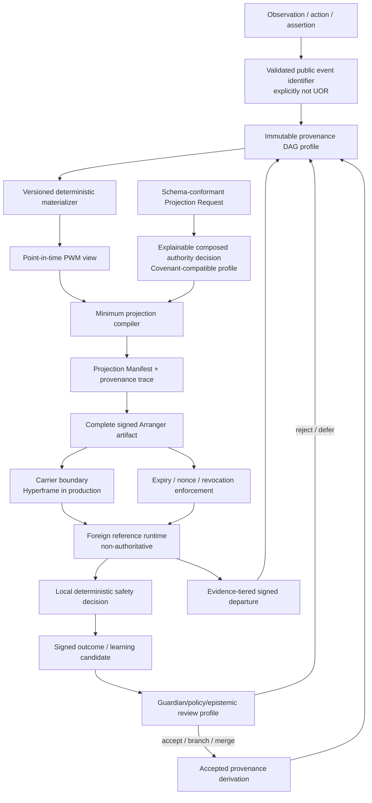
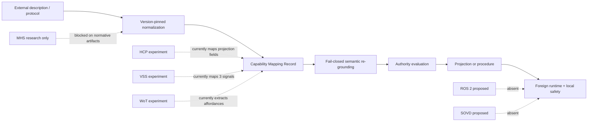

# Implementation Graph

## Reading the graph

This is a dependency graph, not a directory tree. Solid edges describe imports or direct data dependencies present in the repository. Dashed edges describe specified but absent links required for the first milestone. A foreign runtime never becomes a source of canonical PWM state.

## Existing executable graph



## Actual Python import graph

| Consumer | Direct repository dependency | Role |
|---|---|---|
| `plog.py` | `canonical.sha256_urn` | Hash event bodies and identifiers. |
| `pwm.py` | `plog.PLog` | Replay ordered provenance-profile events. |
| `projection.py` | `canonical.sha256_urn`, `authority.Decision`, `pwm.PWMState` | Compile selected state under a capability decision. |
| `crypto.py` | `canonical.canonical_json` | Sign and verify local canonicalized JSON bytes. |
| `arranger.py` | `canonical.sha256_urn`, `crypto.sign_json`, `crypto.verify_json` | Identify and sign an Arranger artifact. |
| `learning.py` | `canonical.sha256_urn` | Identify a non-canonical learning candidate. |
| `departure.py` | `canonical.sha256_urn` | Identify a bounded departure record. |
| `web0.py` | `canonical.sha256_urn`, `crypto.sign_json`, `crypto.verify_json` | Identify and sign a machine broadcast. |
| `demo.py` | PLOG, PWM, authority, projection, crypto, Arranger, learning, departure, Web0 | Compose the current demonstration. |
| HPL-CONTEXT harness | Demo fixture, materializer, authority, projection | Count disclosed assertions. |

`authority.py` has no repository imports. The HCP, COVESA VSS, and WoT adapters are standalone transformation modules and are not wired into `demo.py` or the lifecycle.

## Current data flow

```text
fixture assertion dictionaries
    -> PLog.append()
    -> public Event records with SHA-256 identifiers
    -> PLog.ordered()
    -> Materializer.materialize()
    -> PWMState

requested capabilities + Constraint records
    -> AuthorityEngine.resolve()
    -> Decision

PWMState + ProjectionRequest + Decision
    -> ProjectionCompiler.compile()
    -> Projection Manifest
    -> ArrangerIssuer.issue()
    -> signed Arranger artifact dictionary

foreign observation (simulated locally)
    -> learning_candidate()
    -> candidate dictionary, not canonical PWM mutation

session end evidence (simulated locally)
    -> make_receipt()
    -> unsigned departure record

machine claim
    -> issue_broadcast()
    -> signed broadcast evidence, not authorization
```

## Existing evidence graph



The evidence graph has three breaks:

- Schemas are validated as schemas but are not used to validate code-generated instances.
- Security requirements are mostly documented fields rather than verifier behavior.
- Benchmarks do not yet test the core utility, authority, lifecycle, or falsifier claims.

## First-milestone target graph



The carrier node is an explicit boundary, not permission to invent a new envelope. In the public repository, a small test carrier or function boundary may demonstrate transport neutrality; production integration must use the existing Hyperframe implementation after discovery.

## Foundational dependency layers

| Layer | Inputs | Outputs | Must be true before dependents proceed |
|---|---|---|---|
| 0. Canon and evidence | Published specifications, status taxonomy, source records | Versioned terminology and claim ledger | Protected meanings and evidence status are mechanically checkable. |
| 1. Public encoding | Canonicalization profile, schemas | Validated bytes and conventional IDs | Deterministic behavior is specified without claiming UOR. |
| 2. Provenance profile | Validated events and parents | Immutable event DAG/closure | Parent/hash/time/signature rules fail closed. |
| 3. Materialization | Authorized event closure, schema/conflict profile, point in time | Reproducible PWM view | History/current state and evidence/interpretation remain distinct. |
| 4. Authority | Requested purpose/capabilities and typed principal constraints | Explainable bounded decision | Capability is not authorization; Covenant compatibility is preserved. |
| 5. Projection | PWM view, exact authority decision, recipient/environment profile | Minimal projection plus trace | Raw PWM does not cross the boundary; unknown semantics fail closed. |
| 6. Crystallization | Projection and representation policy | One of five canonical rungs | No sixth rung is introduced. |
| 7. Arranger | Crystallized payload and bindings | Signed, revocable artifact | Arranger remains distinct from Hyperframe. |
| 8. Foreign execution | Artifact, carrier, runtime compatibility | Local accept/refuse and bounded outcome | Foreign runtime is non-authoritative; local safety can veto. |
| 9. Lifecycle return | Outcome, revocation/expiry state, departure evidence | Candidate, receipt, review decision | No silent mutation or universal forgetting claim. |
| 10. Reconciliation | Accepted review decision | New provenance derivation and rematerialized PWM | Every accepted state change is attributable. |
| 11. Interoperability | Stable boundary contracts | HCP/A2A/MCP/ROS/VSS/SOVD/WoT mappings | External vocabularies remain adapters, not semantic authority. |
| 12. Demonstrations and benchmarks | Complete vertical slice | Reproducible claims and falsifiers | Every claim names a baseline, metric, threshold, and limitation. |

## Adapter dependency graph



The current adapters do not share a common Capability Mapping Record, pinned-source registry, or lifecycle integration. Their tests correctly establish only narrow boundary properties.

## Demonstration dependencies

| Demonstration | Required predecessor chain | Current state |
|---|---|---|
| First milestone: foreign bounded projection | Layers 0 through 10 | Stops at locally constructed artifact/candidate/receipt records; no foreign runtime or reconciliation. |
| Robot kitchen delivery | First milestone + spatial projection + local safety fixture | Partial local demo only. |
| Fleet authority conflict | Typed authority + changing local machine state + explanation | Documentation and generic set test only. |
| Vehicle service support | Web0 broadcast + multi-principal authority + VSS/VISS + SOVD + lifecycle | Proposed and intentionally deferred. |
| Sovereign AI Grid | Production NEP + Guardian + existing Edge Twin + placement evidence | Not implementable honestly from this public repository alone. |

## Test dependency graph

```text
schema metaschema validity
    -> generated-instance conformance
    -> module contract tests
    -> provenance/materialization conformance
    -> authority/projection conformance
    -> artifact lifecycle conformance
    -> foreign-runtime integration
    -> learning/departure reconciliation
    -> interoperability profiles
    -> benchmarks and falsifiers
```

Only the first level and selected module behavior tests exist. No later evidence should be treated as proven until its predecessor evidence exists.

## Production fold-in boundary

The following production nodes are intentionally outside the executable public graph and must be discovered before integration:

- canonical UOR object/address/certificate owners;
- canonical PLOG signer, DAG, and derivation owners;
- production PWM/metagraph stores and materializers;
- Covenant Atom and Guardian decision owners;
- Hyperframe and live Arranger/D5 owners;
- NEP extension and placement owners;
- UHR runtime owners;
- A2A and MCP boundary owners;
- existing Edge Twin owners;
- BWM, Web0, and IntentCasting owners.

Until those repositories are supplied, all production graph edges remain `DEFER`, and no public module may be promoted into a competing authority.
