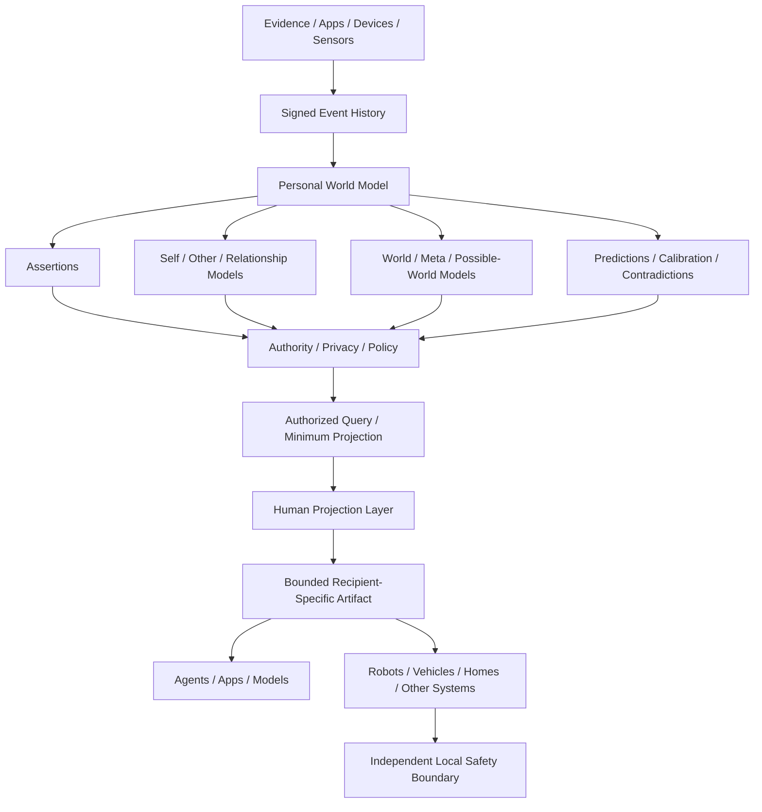
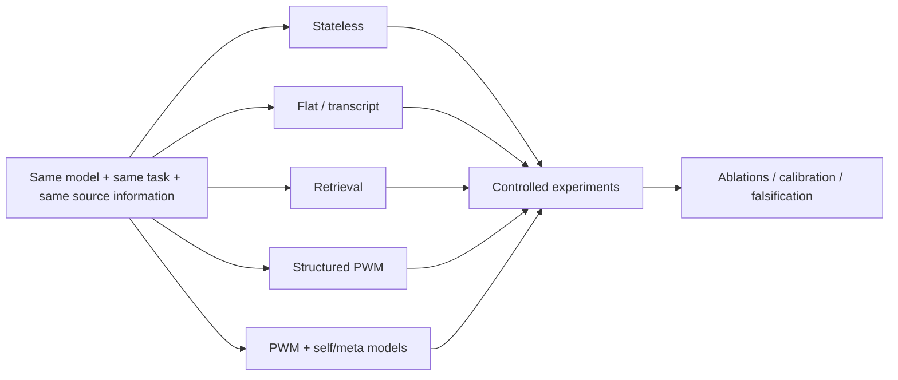

# Personal World Models

[](https://github.com/Balnce-AI/personal-world-models/actions/workflows/test.yml)
[](LICENSE)
[](pyproject.toml)
[](rust-toolchain.toml)

> **An open architecture for persistent, sovereign, temporal, provenance-bearing models of a person and their world, designed to augment AI systems without turning the person into someone else's data store.**

This repository contains public specifications, executable reference implementations, conformance suites, SDK boundaries, simulations, and research protocols for **Personal World Models (PWM)** and the **Human Projection Layer (HPL)**.

The evidence boundary matters: the Wave 01 provenance profile is stable; signed semantics and HPL are provisional; the broader model ecology, SDK, physical-AI runtime, and cognition research remain experimental. This is not a production identity authority, robotics safety system, or claim of consciousness or AGI.

## What Is A Personal World Model?

A Personal World Model is an evolving, user-governed representation of a person and the world in which they act. It can model:

- self, goals, preferences, capabilities, constraints, and metacognitive state;
- other people and agents;
- relationships and shared context;
- physical, digital, and social world state;
- record time, valid time, change, staleness, and uncertainty;
- evidence, provenance, predictions, calibration, and contradictions;
- actual and isolated possible worlds;
- privacy, authority, policy, and bounded disclosure.

It is not interchangeable with adjacent mechanisms:

| Mechanism | Primary question | Why it is not a PWM |
| --- | --- | --- |
| Chatbot memory | What should this conversation remember? | Usually session- or provider-scoped, with limited structure and governance. |
| Vector-store memory | Which stored chunks are similar to this query? | Similarity retrieval does not define temporal truth, authority, contradiction, or model lifecycle. |
| User profile | Which fields describe this user? | A profile is generally flat and current-state oriented rather than causal, temporal, epistemic, and provenance-bearing. |
| RAG | Which source passages should augment this inference? | Retrieval selects information; it does not maintain an evolving model of the person's world. |
| Centralized personal-data platform | Where is personal data aggregated? | Storage location alone does not establish sovereign authority, model semantics, or minimum disclosure. |

A memory system, vector index, profile, or retrieval engine may participate in a PWM. None defines the whole architecture.

## Research Thesis

A foundation model is an inference engine. A Personal World Model supplies persistent, structured, temporal, provenance-bearing state about the person and their world. This repository tests whether coupling the two produces more capable, continuous, calibrated, and accountable situated intelligence than stateless inference, flat memory, or retrieval alone.

That proposition is a hypothesis, not a result. The repository provides matched-context experiments and ablations needed to test it; it does **not** currently claim that PWM outperforms retrieval or that it creates consciousness, AGI, or human-level intelligence.

## Architecture



External systems receive a purpose-bound projection, not unrestricted access to the PWM. The signed event DAG is the reconstruction source; materialized state is disposable. Capability discovery never grants authority, model output is never automatically accepted state, and possible worlds remain isolated from actual-world state.

The research path controls for information quantity:



See [the architecture map](docs/ARCHITECTURE.md), [public ADRs](docs/adr/README.md), and [status taxonomy](STATUS.md).

## What Exists Today

- Restricted deterministic CBOR, typed domain-separated CIDs, Ed25519 event signatures, signed append receipts, key-state validation, deterministic causal-DAG replay, and an atomic SQLite reference store.
- A constrained model ecology for `SELF`, `OTHER`, `RELATIONSHIP`, `WORLD`, `META`, and `POSSIBLE_WORLD` models.
- Evidence-backed proposal, review, acceptance, update, dispute, revocation, prediction, and calibration flows.
- Privacy-taint propagation, explicit redaction/proof boundaries, and bounded declassification.
- Typed contradiction lifecycle, acyclic model dependencies, deterministic authorized queries, and possible-world isolation.
- HPL capability negotiation, purpose/recipient-bound authority, minimum projections, expiry/revocation, departure evidence, and non-actuating physical-AI simulation.
- A provider-neutral foundation-model protocol with local callable, Ollama, and OpenAI-compatible adapters.
- A public Python SDK facade, role-specific adapter protocols, extension manifests, templates, and runnable examples.
- A preregisterable, information-matched research harness with synthetic personas, 25 scenarios, sixteen conditions/controls, tokenizer accounting, and generated manifests.
- Language-neutral schemas, signed bundles, expected outputs, a conformance runner, and independent Rust and Python semantic reducers.

## Stability

Status describes evidence and compatibility, not ambition.

| Surface | Current repository status |
| --- | --- |
| Wave 01 public provenance profile | `STABLE` |
| Signed semantic profile | `PROVISIONAL` |
| Model ecology implementation | `EXPERIMENTAL`; conformance suite `PROVISIONAL` |
| HPL boundary and projection suite | `PROVISIONAL`; physical runtime `EXPERIMENTAL` |
| Python SDK facade | `EXPERIMENTAL` |
| Python package / Rust reference crates | `0.2.0` / `0.2.0-alpha.1` |
| Research protocol and fixture-control results | `EXPERIMENTAL` |
| Functional Consciousness / FSMA compatibility | `RESEARCH` |
| Micro / Edge / Full footprints | `PROPOSED` design guidance |
| Synchronization and federation | Design only; not implemented |

The machine-readable conformance source is [`conformance/manifest.json`](conformance/manifest.json); component evidence and release disposition are recorded in [`governance/components.json`](governance/components.json). See [`VERSIONING.md`](VERSIONING.md), [`PLATFORM_STABILIZATION_STATUS.md`](PLATFORM_STABILIZATION_STATUS.md), and the [temporary architectural freeze](governance/ARCHITECTURAL_FREEZE.md) before depending on an interface.

## Fifteen-Minute Quickstart

Prerequisites: Python 3.11+; Rust 1.96 is required for the Rust provenance and semantic implementations.

### Install From A Checkout

```bash
git clone https://github.com/Balnce-AI/personal-world-models.git
cd personal-world-models
python -m venv .venv
source .venv/bin/activate
pip install -e '.[dev,research]'
```

The Python package is currently distributed as source from this repository; no PyPI release is claimed.

### Create A PWM And Add Evidence

```python
from pwm import EventDraft, InMemoryStorageAdapter, PersonalWorldModel

def authorize(operation, request):
    if operation == "append_event":
        return {"authorizationRef": "example:local-write"}
    return None

pwm = PersonalWorldModel.open(
    storage=InMemoryStorageAdapter(),
    authorize=authorize,
)

with pwm:
    receipt = pwm.append_event(
        EventDraft(
            "entity.put",
            {"id": "person:self", "type": "Person"},
            "person:self",
        )
    )
    state = pwm.materialize()
    print(receipt.event_id, sorted(state.entities))
```

This example is intentionally explicit about storage and authorization. For evidence, reviewed model state, possible worlds, and adapter lifecycle, run the maintained examples:

```bash
python examples/quickstart/b_append.py
python examples/quickstart/b_derive_model.py
python examples/quickstart/e_possible_world.py
python examples/quickstart/f_custom_adapter.py
```

### Attach A Local Model

No hosted provider is required:

```bash
python examples/quickstart/c_local_model.py
```

The example implements `ReasoningModel` with `LocalCallableModel`. Model output is returned as an untrusted result; accepting a derived model requires a separate lifecycle operation. Ollama and OpenAI-compatible examples are documented in [Foundation-Model Augmentation](docs/research/FOUNDATION_MODEL_AUGMENTATION.md).

### Generate A Bounded HPL Projection

```bash
python examples/quickstart/d_hpl_projection.py
python examples/quickstart/g_simulate.py
```

### Run The Research Harness

```bash
pwm-research run \
  --model fixture-control \
  --persona experiments/data/personas/longitudinal-persona.json \
  --output /tmp/pwm-fixture-control.json
```

The fixture control validates experiment plumbing. It is not evidence of foundation-model improvement.

### Run Conformance

```bash
pwm-conformance verify \
  --implementation rust-signed-semantic \
  --profile PWM-MODEL-ECOLOGY-1

pwm-conformance verify \
  --implementation python-signed-semantic \
  --profile PWM-MODEL-ECOLOGY-1

pwm-conformance compare \
  --implementations rust-signed-semantic python-signed-semantic \
  --suite PWM-SIGNED-SEMANTICS-V1
```

The installed command expects a repository checkout containing `scripts/` and `conformance/`. See the [conformance runner guide](docs/conformance-runner.md).

## Signed Semantic Conformance V1

The strongest current interoperability result is deliberately narrow and reproducible:

- canonical semantic payloads travel through the signed Wave 01 provenance layer;
- authenticated principals receive explicit scope, operation, capability, and validity grants;
- cryptographic verification and deterministic causal replay occur before semantic reduction;
- independently implemented Rust and Python reducers consume the same signed bundles;
- each implementation passes all 21 cases required by `PWM-MODEL-ECOLOGY-1`;
- both reducers produce byte-identical normalized outputs for the 20-case `PWM-SIGNED-SEMANTICS-V1` suite;
- claims are bound to an implementation commit, suite version and SHA-256, per-case output digests, and immutable result artifacts.

| Evidence | Value |
| --- | --- |
| Suite SHA-256 | `f1fda71d804a3e03ec3157ba11d10696e8f7c57845b622f2ef4c048e6289778b` |
| Rust/Python result SHA-256 | `02b058aa9a8b72f265a8627e7620ca7db56bb615d86765dd19e2857713fe2f28` |
| Cumulative level | `PWM-MODEL-ECOLOGY-1`, 21 cases per implementation |
| Profile status | `PROVISIONAL` |

Start with:

- [formal implementation claims](conformance/claims/);
- [conformance evidence report](governance/SIGNED_SEMANTIC_CONFORMANCE_REPORT.md);
- [signed semantic profile](spec/signed-semantic-conformance-v1.md) and [payload maps](spec/signed-semantic-payloads-v1.md);
- [signed suite](conformance/vectors/signed-semantic-suite.json) and [source bundles](conformance/sources/);
- [independent implementation guide](docs/independent-implementation-guide.md).

This establishes agreement for the exact provisional profile and suite. It is not a permanent standard, proof of all semantic correctness, or production security certification.

## Human Projection Layer

**PWM is the rich sovereign internal model. HPL produces bounded, purpose-specific representations for external systems.**

A robot, vehicle, application, or model should receive the minimum authorized representation required for an interaction, not unrestricted access to the person's world model. The current HPL path separates:

1. capability discovery;
2. projection request;
3. request-bound authority evidence;
4. semantic negotiation and fail-closed mapping;
5. privacy propagation and field minimization;
6. expiring projection issuance;
7. recipient-local safety evaluation;
8. revocation, departure evidence, and reviewed learning return.

Illustrative target profiles cover a [vehicle](profiles/hpl-targets/vehicle.json), [home](profiles/hpl-targets/home.json), [service robot](profiles/hpl-targets/robot.json), [accessibility environment](profiles/hpl-targets/accessibility.json), [storefront](profiles/hpl-targets/storefront.json), [industrial system](profiles/hpl-targets/industrial.json), [delegated caregiver](profiles/hpl-targets/caregiver.json), and [shared environment](profiles/hpl-targets/shared-environment.json).

These profiles do not confer authority. The current foreign runtime is a non-actuating simulator and returns bounded outcomes such as `WOULD_DISPATCH` or `REFUSED`; it never drives hardware. See [HPL Platform](docs/HPL_PLATFORM.md) and the [threat model](security/THREAT_MODEL.md).

## Research Program

The research harness asks whether representational structure matters after controlling for model, task, source information, and rendered budget. Its experimental arms include:

- stateless inference;
- full transcript;
- flat normalized source facts;
- raw-event retrieval;
- normalized-fact retrieval;
- structured assertions;
- flat source plus derived state;
- structured self/other/relationship/world model ecology;
- structured ecology plus meta-models;
- information-matched flat and structured conditions;
- shuffled topology, redacted provenance, stale state, corrupt confidence, random context, and adversarial controls.

The distinction under test is **information quantity versus representational structure**. Exact token matching alone does not establish causal benefit, and provider tokenizers are not treated as verified unless measured appropriately.

The [PWM Context-Matched Experiment Protocol](experiments/protocols/pwm-context-matched-v1.md) defines the hypothesis, falsifier, required arms, matching rules, and analysis. The checked-in fixture result proves that the harness executes end to end; no real foundation-model superiority claim has yet been established.

## Functional Consciousness / FSMA

Frank W. Bergmann's Functional Consciousness (FC) and Functional Self-Model Analysis (FSMA) motivated part of the explicit self-model research program. The optional compatibility profile represents Bergmann's ten broad domains as attributed, namespaced research families.

PWM generalizes beyond self-models into other, relationship, world, temporal, provenance, authority, contradiction, metacognitive, and possible-world structures. FC is not treated as PWM's ontology, Bergmann is not represented as endorsing PWM, and no Functional Consciousness Score is presented as a validated consciousness metric. The full 46-model catalog remains intentionally blocked until its exact labels and definitions can be verified from an appropriate preserved primary source.

See [the compatibility profile](profiles/functional-consciousness/README.md), [mapping notes](docs/research/BERGMANN_MAPPING.md), and [provenance record](profiles/functional-consciousness/provenance.md).

## Independent Implementations

**Python is a reference implementation, not the definition of PWM.**

An implementation in Rust, Swift, TypeScript, Zig, Kotlin, C++, a browser runtime, or an embedded environment should implement the public contracts rather than reproduce Python internals:

1. Start with the normative documents in [`spec/`](spec/) and the immutable schema identifiers in [`schemas/catalog.json`](schemas/catalog.json).
2. Implement Wave 01 canonical bytes, typed CIDs, signatures, receipts, key-state checks, and deterministic replay.
3. Consume the language-neutral valid and invalid vectors in [`conformance/`](conformance/).
4. Implement signed semantic payload validation, authenticated grants, error precedence, atomic reduction, and normalized outputs.
5. Register a process adapter under [`conformance/implementations/`](conformance/implementations/) and run `pwm-conformance`.
6. Publish a commit- and suite-digest-bound claim only after matching normative expectations and an independent implementation.

The [implementation guide](docs/independent-implementation-guide.md), [conformance overview](docs/conformance.md), [semantic diff format](docs/semantic-diff-format.md), [versioning rules](VERSIONING.md), and [extension rules](docs/EXTENSIONS.md) define the portability boundary.

## Extension Architecture

Third parties can implement narrow, independently authorized roles for:

- storage;
- evidence and multimodal references;
- identity resolution;
- transport;
- tools and agents;
- devices;
- projections;
- foundation models;
- model families;
- scenarios, simulators, and benchmarks.

Start with [`templates/adapter/`](templates/adapter/), [`templates/benchmark/`](templates/benchmark/), [`extensions/`](extensions/), and [adapter guidance](docs/ADAPTERS.md). Extensions use owned namespaces, declare dependencies and custody, fail unknown semantics closed, and do not redefine canonical IDs or gain authority through capability discovery.

## Micro, Edge, And Full Footprints

These are portability targets, not claims that all profiles are implemented:

| Footprint | Intended capacity | Required invariant |
| --- | --- | --- |
| Micro | Event capture, bounded verification, references | No hidden canonical cloud dependency |
| Edge | Partial materialization, policy enforcement, offline queue | Privacy-segment and revocation enforcement |
| Full | Complete authorized replica, research and model lifecycle | Provenance closure and deterministic reconstruction |

They are hardware-neutral resource envelopes for phones, embedded devices, robots, vehicles, desktops, edge nodes, and servers. See [Portability Architecture](docs/PORTABILITY_ARCHITECTURE.md). Distributed synchronization and federation remain design-only.

## What Can I Build?

Within the current experimental boundaries, this repository can support work on:

- local-first personal assistants and accessibility systems;
- personal or organizational research agents;
- foundation-model augmentation and controlled context studies;
- edge or embedded personal-intelligence prototypes;
- privacy-minimized application and tool integrations;
- non-actuating robot, vehicle, home, storefront, workplace, and industrial interaction simulations;
- alternative-language provenance and semantic implementations;
- custom adapters, model families, scenario corpora, and conformance suites.

Real-world deployment still requires production identity, key custody, policy, storage, synchronization, operational security, and domain-specific safety systems outside this reference repository.

## Open Research Questions

- Does structured PWM outperform information-matched flat state or retrieval?
- Does model topology itself contribute measurable utility?
- Do explicit self- and meta-models improve calibration and error correction?
- Can a smaller model plus a rich PWM outperform a larger stateless model on situated tasks?
- Can situated competence survive replacement of the foundation model?
- How should model boundaries and families be individuated without uncontrolled ontology growth?
- What state should intentionally remain unmodeled or ephemeral?
- How should partial, offline, and distributed PWMs synchronize without violating privacy or revocation?
- How should HPL interoperate with real physical systems while preserving independent local safety authority?

See the broader [research question register](docs/research/RESEARCH_QUESTIONS.md).

## Boundaries And Non-Goals

This public repository is not:

- the complete Balnce product or architecture;
- the Reasn architecture;
- the Neural Engine Protocol (NEP);
- Web0;
- Fiduciary DNA (FDX);
- a private or production PLOG/UOR implementation;
- a consciousness implementation or validated consciousness metric;
- a centralized personal-data cloud;
- a production-certified identity, medical, vehicle, robotics, industrial, or safety system.

Those systems may eventually interoperate through explicit boundaries. They are not absorbed into PWM, and this repository does not publish substitutes for them.

## Repository Map

```text
spec/              normative and proposed public specifications
schemas/           machine-readable public schemas and catalog
conformance/       suites, vectors, signed bundles, results, and claims
crates/             Rust provenance and signed semantic implementations
src/pwm/            experimental Python SDK facade
src/pwm_hpl_ref/    Python reference implementation
experiments/        synthetic data, protocols, and generated results
profiles/           HPL targets and research compatibility profiles
examples/           runnable SDK, adapter, and simulation examples
benchmarks/         falsifiable evaluation harnesses
docs/               architecture, research, SDK, and implementation guides
governance/         status records, claim ledger, and evidence reports
security/           threat model and lifecycle security analysis
templates/          contribution templates for adapters, ADRs, and benchmarks
```

## Research And Citation

Use [`CITATION.cff`](CITATION.cff) to cite the software and this repository. There is no associated peer-reviewed paper or DOI at this time; the documents under [`papers/`](papers/) are research outlines, not publication claims.

Research contributions should state a falsifiable hypothesis, information and tokenizer controls, negative controls, model/version parameters, synthetic or public data provenance, and limitations. See [`CONTRIBUTING.md`](CONTRIBUTING.md).

## Contributing, Security, And License

- [Contributing guide](CONTRIBUTING.md)
- [Security policy](SECURITY.md)
- [Code of Conduct](CODE_OF_CONDUCT.md)
- [Changelog](CHANGELOG.md)
- [Signed Semantic Conformance release notes](docs/releases/signed-semantic-conformance-v1.0.0-provisional.md)
- [MIT License](LICENSE)

The long-term question is not only whether AI can remember you. It is whether **your own intelligence can remain continuous while the computational body around it changes** without requiring each model, application, vehicle, robot, workplace, or network to own a separate permanent theory of you.
