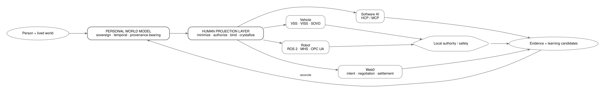

# Personal World Model

> **A research specification and executable reference implementation for user-owned, provenance-bearing personal intelligence.**

**Repository status:** `V2 RECONSTRUCTION + V1 REFERENCE`
**License:** MIT

## The problem

Every AI application, service, vehicle, robot, wearable, and platform is beginning to build a model of the people who use it.

Those models are normally fragmented by provider. They may remember facts, infer preferences, predict behavior, or personalize an interface, but the person rarely controls the authoritative model across systems. Physical AI raises the stakes further: useful personalization may involve a person's identity, relationships, goals, permissions, spatial understanding, accessibility requirements, assets, trust, or current intent.

The obvious answer—copy the person's entire history into every system—is the wrong architecture.

## The thesis

**The person should own the authoritative model of their world.**

Foreign systems should receive only the minimum derived representation required for an authorized purpose, for a bounded time, under explicit policy, with provenance and measurable lifecycle guarantees.

We call the durable model the **Personal World Model (PWM)** and the outward control mechanism the **Human Projection Layer (HPL)**.



```text
Person + lived world
        │
        ▼
Personal World Model
sovereign • temporal • provenance-bearing
        │
        ▼
Human Projection Layer
minimize • authorize • bind • crystallize
        │
        ├────────────┬─────────────┬─────────────┐
        ▼            ▼             ▼             ▼
 software AI       vehicle        robot        Web0
        │            │             │             │
        └────────────┴──────┬──────┴─────────────┘
                            ▼
                    local authority/safety
                            │
                            ▼
                     action + evidence
                            │
                            ▼
                     learning candidate
                            │
                            ▼
                         PWM
```

## A PWM is not a memory database

A memory system asks **what was retained?**

A Personal World Model must also answer:

- What exists in this person's world?
- What relationships connect those entities?
- What is observed, asserted, believed, inferred, predicted, disputed, or revoked?
- What changed, and when?
- What does the person want to make true?
- What is permitted, prohibited, delegated, or committed?
- What is uncertain?
- What can be acted on now?
- What must not be disclosed to this recipient?
- What happened as a result of prior actions?

Memory is a component. A vector database can be a component. A personal SLM can be an execution artifact. None is the whole model.

## HPL: the person enters without being copied

HPL is the **policy-governed projection and lifecycle control plane** for bounded representations derived from a PWM (or organizational world model).

A projection can be context, a verifiable predicate, authority, a policy, a spatial slice, a deterministic procedure, a model adapter, a distilled model, session state, or a proof. The canonical PWM remains under the person's authority.

A foreign machine still owns its physical safety boundary.

```text
human intent
    ↓
HPL authorization + projection
    ↓
capability contract
    ↓
foreign runtime
    ↓
local safety kernel
    ↓
actuation
```

## What this repository implements now

- A V2 public provenance profile with restricted deterministic CBOR, typed domain-separated CIDs, Ed25519 signatures, signed append receipts, and deterministic causal-DAG replay.
- Independent Rust and Python conformance verification over checked-in valid and malformed vectors.
- Independent Rust and Python reducers that agree on the provisional signed semantic suite after Wave 01 verification.
- An atomic SQLite reference store that re-verifies present records during recovery and fails closed on record mutation or edge inconsistency. Valid-suffix deletion and whole-database rollback require an externally protected expected head and are outside this reference profile.
- A Rust CLI for vector generation, event verification, and replay.
- A synthetic 1K/10K/100K DAG validation and replay benchmark with environment metadata and bounded claims.
- An experimental functional model ecology with constrained self/other/relationship/world/meta/possible-world records, proposal/review/acceptance lifecycle, privacy-taint propagation, explicit contradictions, topology, deterministic queries, prediction resolution, and calibration.
- A provider-neutral foundation-model protocol with local callable, OpenAI-compatible HTTP, and Ollama adapters; model outputs remain unaccepted candidates.
- A normalized 25-scenario PMRA corpus, information ledgers, exact rendered-budget matching under declared tokenizer adapters, sixteen canonical research conditions/controls, and generated experiment and coverage manifests.
- Provisional language-independent conformance levels and semantic vectors for model ecology and HPL behavior; no current implementation claims those provisional levels yet.
- An experimental `pwm` Python SDK facade, role-specific adapter protocols, a namespaced third-party extension example, and deterministic simulation source.
- Experimental HPL capability negotiation, eight illustrative target profiles, bounded projection artifacts, lifecycle/revocation records, and non-actuating physical-AI simulations.
- The archived V1 Python reference capabilities listed below while their V2 successors are reconstructed wave by wave.
- A deterministic, event-backed reference PWM materializer.
- Typed entities, relations, assertions, temporal validity, epistemic status, and provenance references.
- A scoped HPL projection compiler.
- Multi-principal constraint composition reference logic.
- Signed, recipient-bound **Arranger** artifacts with TTL, nonce, provenance references, and revocation handles.
- Learning-return candidates rather than silent foreign mutation.
- Evidence-tiered departure receipts instead of a universal “the machine forgot” claim.
- Signed machine `NEED`, `CAPABILITY`, `AVAILABILITY`, and `SUPPORT_REQUEST` broadcasts.
- Example fixtures for a kitchen robot, vehicle support, and fleet authority conflict.
- Initial benchmark harnesses for disclosure minimization, authority, residue, and portability.

## What remains research

- Universal model-adapter portability.
- Reliable privacy bounds for behavioral/model artifacts.
- General proof of deletion on arbitrary foreign hardware.
- Portable spatial privacy semantics across heterogeneous robots.
- General multi-jurisdiction authority composition.
- Automatic learning return without unacceptable poisoning risk.
- Long-horizon PWM ontology evolution.
- OEM adoption of open HPL-style projection interfaces.
- Higher-dimensional UOR/Clifford/sheaf extensions beyond the established UOR base substrate.
- Whether structured PWM context improves real foundation-model cognition; the checked-in deterministic run validates the harness only.
- The complete Bergmann 46-model mapping pending verification against the versioned primary catalog.
- Production-grade signed semantic-event integration, multi-device reconciliation, remote declassification proofs, and safety-certified physical actuation.

## Standards are boundary tools, not replacements

HPL is designed to interoperate with existing and emerging layers:

| External layer | Relationship |
|---|---|
| Stanford Human Context Protocol | Software-AI preference/context interoperability profile. |
| MCP | Tool/data courier. |
| A2A | Agent-to-agent interaction substrate/profile. |
| Anthropic MHS | Emerging physical device description/operation target; compatibility work is withheld until normative artifacts are public and reviewed. |
| ROS 2 | Robot runtime adapter target. |
| COVESA VSS/VISS | Vehicle semantic/data adapter target. |
| SOVD | Vehicle diagnostics/support adapter target. |
| W3C WoT | General thing-description adapter target. |

The repository does **not** claim to replace them.

## Repository map

- [`spec/`](spec/) — PWM, HPL, Arranger, lifecycle, governance, spatial and departure specifications.
- [`math/`](math/) — formal models, projection objective, authority algebra, temporal confidence, UOR proof-status notes.
- [`schemas/`](schemas/) — machine-readable public profiles.
- [`src/pwm_hpl_ref/`](src/pwm_hpl_ref/) — executable Python reference implementation.
- [`src/pwm/`](src/pwm/) — experimental developer-facing Python facade over explicit reference boundaries.
- [`examples/`](examples/) — bounded demonstrations.
- [`benchmarks/`](benchmarks/) — falsifiable evaluation harnesses.
- [`standards/`](standards/) — mapping profiles and integration discipline.
- [`security/`](security/) — threat model and lifecycle guarantees.
- [`crates/`](crates/) — V2 Rust public-profile implementations.
- [`crates/pwm-semantic/`](crates/pwm-semantic/) — provisional Rust reducer over verified signed semantic records.
- [`conformance/`](conformance/) — valid/invalid vectors and the independent Python oracle.
- [`governance/`](governance/) — status metadata, authority records, and wave evidence.
- [`experiments/`](experiments/) — synthetic personas, scenario requirements, generated research artifacts, and limitations.
- [`profiles/functional-consciousness/`](profiles/functional-consciousness/) — attributed FC/FSMA compatibility profile and source-review boundary.
- [`profiles/hpl-targets/`](profiles/hpl-targets/) — illustrative capability-first recipient profiles.
- [`extensions/`](extensions/) — static namespaced extension catalog; no dynamic plugin execution.
- [`docs/ARCHITECTURE.md`](docs/ARCHITECTURE.md) — normative, reference, ecosystem, and research boundaries.
- [`docs/SDK.md`](docs/SDK.md) — layered embedding API and authority-visible developer path.
- [`VERSIONING.md`](VERSIONING.md) — independent protocol, schema, ontology, suite, SDK, and extension version axes.
- [`PLATFORM_STABILIZATION_STATUS.md`](PLATFORM_STABILIZATION_STATUS.md) — implemented, design-only, research-only, and excluded platform surfaces.

## Quick start

V2 public provenance profile:

```bash
cargo test --workspace
cargo run -q -p pwm-cli -- event verify --bundle conformance/vectors/wave01-valid.json
cargo run -q -p pwm-cli -- event replay --bundle conformance/vectors/wave01-valid.json
python3 conformance/python/pwm_oracle.py conformance/vectors/wave01-valid.json
pwm-conformance compare --implementations rust-signed-semantic python-signed-semantic --suite PWM-SIGNED-SEMANTICS-V1
```

V1 Python reference:

```bash
python -m venv .venv
source .venv/bin/activate
pip install -e '.[dev,research]'
pytest
pwm-hpl-demo
pwm-research run --persona experiments/data/personas/longitudinal-persona.json --output experiments/results/fixture-control.json
python examples/quickstart/a_create.py
```

The demo constructs a bounded PWM fixture, evaluates authority, compiles a minimum projection for a kitchen-delivery robot, signs an Arranger, records a learning candidate, and issues a departure receipt.

The research command runs the deterministic fixture control across baseline, structured-model, and negative-control conditions. Its generated result demonstrates end-to-end machinery, not foundation-model improvement. Researchers can implement the same `ReasoningModel` protocol with local or hosted models while keeping credentials external.

Application developers can start with `from pwm import PersonalWorldModel`. The facade keeps event writes, model review, query authorization, HPL projection, possible worlds, adapters, and research hooks explicit rather than hiding sovereignty boundaries behind one opaque API. See `examples/quickstart/` for the complete A-G path.

Minimal embedded reference:

```python
from pwm import EventDraft, InMemoryStorageAdapter, PersonalWorldModel

pwm = PersonalWorldModel.open(
    storage=InMemoryStorageAdapter(),
    authorize=lambda operation, request: (
        {"authorizationRef": "quickstart:local-write"}
        if operation == "append_event" else None
    ),
)
with pwm:
    pwm.append_event(EventDraft("entity.put", {"id": "person:self", "type": "Person"}, "person:self"))
    state = pwm.materialize()
```

This deliberately exposes storage and authorization dependencies. It is not a convenience API that silently grants access or mutates accepted models.

## Research discipline

Every major claim should be either:

1. backed by executable evidence;
2. backed by a primary external source;
3. stated as a proposed design;
4. or given a falsifier.

A hard problem becomes more credible when its boundary is explicit.

## What this repository does not claim

- Universal machine deletion guarantees.
- Safety certification of robots, vehicles, medical systems, or industrial equipment.
- Universal LoRA/model-adapter compatibility.
- A replacement for OEM safety systems, ROS, AUTOSAR, HCP, MHS, MCP, COVESA, or other standards.
- A completed scientific answer to lifelong personal modeling.
- That every component was invented here.

## Why this matters

The long-term question is not only whether AI can remember you.

It is whether **your own intelligence can remain continuous while the computational body around it changes**—another model, another app, another vehicle, another robot, another workplace, another network—without requiring each one to own a separate permanent theory of you.
